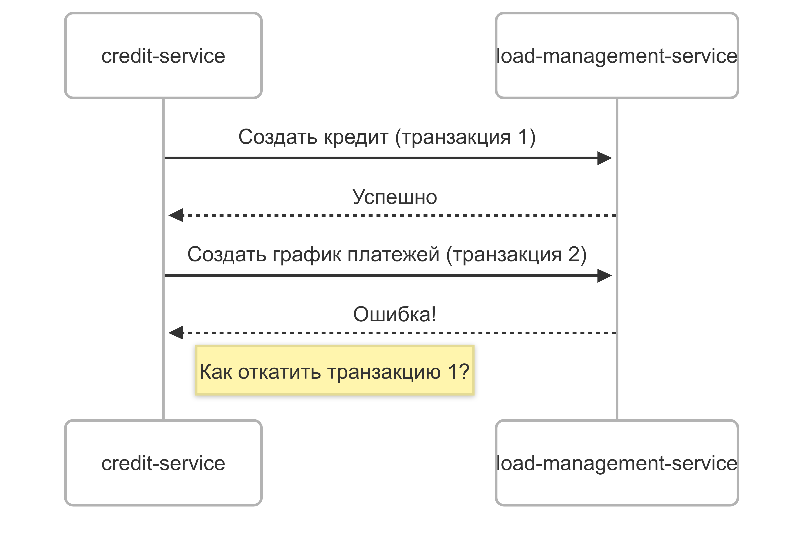

# Учебное задание: Управление транзакциями в кредитном процессе

### Цель 
Реализовать безопасное межсервисное взаимодействие между credit-service и loan-management-service с корректной обработкой транзакций и откатов при ошибках.

Проблематика:

---

## 📌 **Функциональность**
 
Реализовать обработку следующих кейсов:
1. частичный отказ при создании кредита: кредит создан, но не создан график платежей
2. дублирование операций при таймауте: Первый запрос выполнился, но клиент не получил ответ
3. несогласованность данных между сервисами: В credit-service статус "APPROVED", но в loan-management-service кредит не создан
---

## 🛠 **Технологии**
- spring @Transactional (для локальных транзакций)
- saga pattern (для распределенных транзакций)
- idempotency Keys (для повторных запросов)
- retry + circuit breaker
---

## 🧪 Тестирование

1. Интеграционные тесты:
- поможет WireMock

2. Unit тесты:
---
